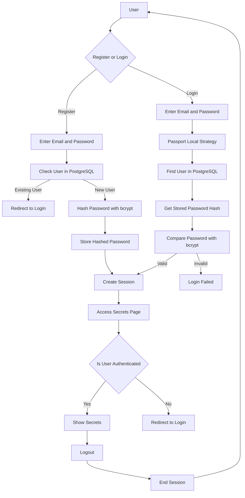

# 🔐 `SECRET KEY`
### `Authentication • Security • Sessions`

A secure authentication web application built with **Node.js, Express.js, PostgreSQL, Passport.js, and bcrypt**.

The application allows users to register, log in securely, maintain an authenticated session, and access a protected secrets page.

---

## Tech Stack

| Technology                                                                                                          | Purpose               |
| ------------------------------------------------------------------------------------------------------------------- | --------------------- |
|           | JavaScript runtime    |
|     | Web framework         |
|  | Database              |
|  | Authentication        |
|                         | Password hashing      |
|                       | Template engine       |
|              | Environment variables |

---

## Features

* User registration and login
* Secure password hashing with bcrypt
* Passport.js local authentication
* PostgreSQL database integration
* Session-based authentication
* Protected `/secrets` route
* User logout
* EJS-based server-side rendering
* Environment variable configuration

---

## Authentication & Security Flow



### Security Process

**Registration**
```
Password
   ↓
bcrypt.hash()
   ↓
Hashed Password
   ↓
PostgreSQL
```

**Login**

```
Password
   ↓
Passport Local Strategy
   ↓
PostgreSQL
   ↓
Stored Password Hash
   ↓
bcrypt.compare()
   ↓
Authenticated Session
```

**Protected Route**

```
/secrets
   ↓
req.isAuthenticated()
   ↓
Authenticated → Access
Not Authenticated → /login
```
---

## Project Structure

```text
Secret-Key/
│
├── public/
│   └── css/
│       └── styles.css
│
├── views/
│   ├── partials/
│   │   ├── footer.ejs
│   │   └── header.ejs
│   │
│   ├── home.ejs
│   ├── login.ejs
│   ├── register.ejs
│   └── secrets.ejs
│
├── .gitignore
├── README.md
├── index.js
├── package.json
└── package-lock.json
```

---

## Database Setup

Create a PostgreSQL database and a `users` table:

```sql
CREATE TABLE users (
    id SERIAL PRIMARY KEY,
    email VARCHAR(100) UNIQUE NOT NULL,
    password VARCHAR(255) NOT NULL
);
```

Passwords are stored as **bcrypt hashes**, not plain text.

---

## Environment Variables

Create a `.env` file in the project root:

```env
SESSION_SECRET=your_session_secret

PG_USERNAME=your_postgres_username
PG_HOST=localhost
PG_DATABASE=your_database_name
PG_PASSWORD=your_postgres_password
PG_PORT=5432
```

Add `.env` to `.gitignore` to prevent sensitive credentials from being committed.

---

## Installation

### 1. Clone the repository

```bash
git clone <repository-url>
cd Secret-Key
```

### 2. Install dependencies

```bash
npm install
```

### 3. Configure environment variables

Create `.env` and add your PostgreSQL and session credentials.

### 4. Start the server

```bash
node index.js
```

The application will be available at:

```text
http://localhost:3000
```

---

## Routes

| Method | Route       | Description            |
| ------ | ----------- | ---------------------- |
| `GET`  | `/`         | Home page              |
| `GET`  | `/login`    | Login page             |
| `POST` | `/login`    | Authenticate user      |
| `GET`  | `/register` | Registration page      |
| `POST` | `/register` | Register new user      |
| `GET`  | `/secrets`  | Protected secrets page |
| `GET`  | `/logout`   | Logout user            |

---

## Security Highlights

* **bcrypt** protects stored passwords using salted hashing.
* **Passport.js** handles local authentication.
* **express-session** maintains authenticated user sessions.
* `/secrets` is protected using `req.isAuthenticated()`.
* PostgreSQL queries use **parameterized values** to reduce SQL injection risk.
* Sensitive configuration is kept in environment variables.

---

## License

This project is created for learning and demonstration purposes.

---
## Author

**Prerna Sharma**

Built as a backend authentication project using Node.js, Express.js, PostgreSQL, Passport.js and bcrypt.
